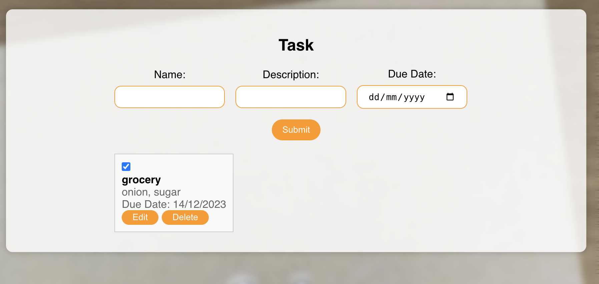

# Getting Started with Create React App

This project was bootstrapped with [Create React App](https://github.com/facebook/create-react-app). and has basic functionality and rendering of the task-app.
A user can add a task with flexibility to set dueDate(future date) and set a reminder for that. 

### Functionalities provided

1. A user is given a form to create a task(s), with description and as optional. I want to extend this functionality to add reminders for due date
2. Upon successfully creating the task, (s)he can see all the tasks created
3. A user can mark the task done by clicking in front of it. `NOTE: A user can only update/modify a task created by him/her.`

### SetUp and installation
Configure API_KEY and TODO_APP_BACKEND_URL in your .env file.
1. `nvm use`
2. `npm i` from the root directory of frontend
3. `npm start` The web page will be rendered at http://localhost:3000

### Snapshot

### `npm test`
Launches the test runner in the interactive watch mode.

### `npm run build`

Builds the app for production to the `build` folder.
It correctly bundles React in production mode and optimizes the build for the best performance.

The build is minified and the filenames include the hashes.\
Your app is ready to be deployed!

### `npm run eject`

**Note: this is a one-way operation. Once you `eject`, you can't go back!**

If you aren't satisfied with the build tool and configuration choices, you can `eject` at any time. This command will remove the single build dependency from your project.

Instead, it will copy all the configuration files and the transitive dependencies (webpack, Babel, ESLint, etc) right into your project so you have full control over them. All of the commands except `eject` will still work, but they will point to the copied scripts so you can tweak them. At this point you're on your own.
